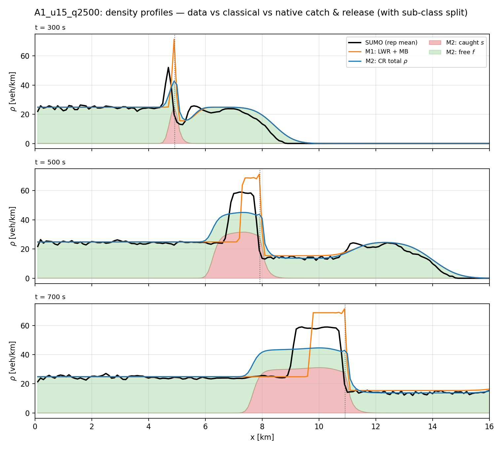
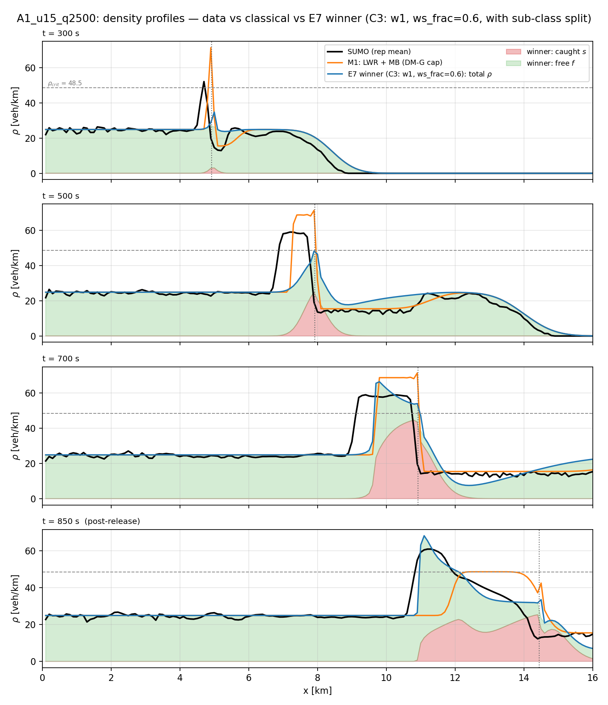
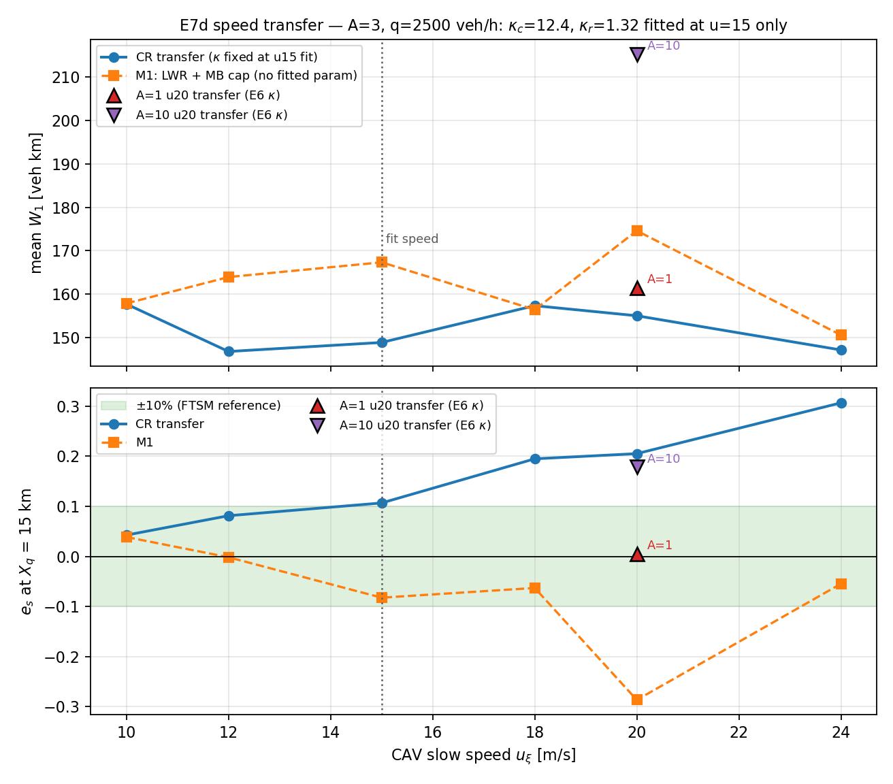
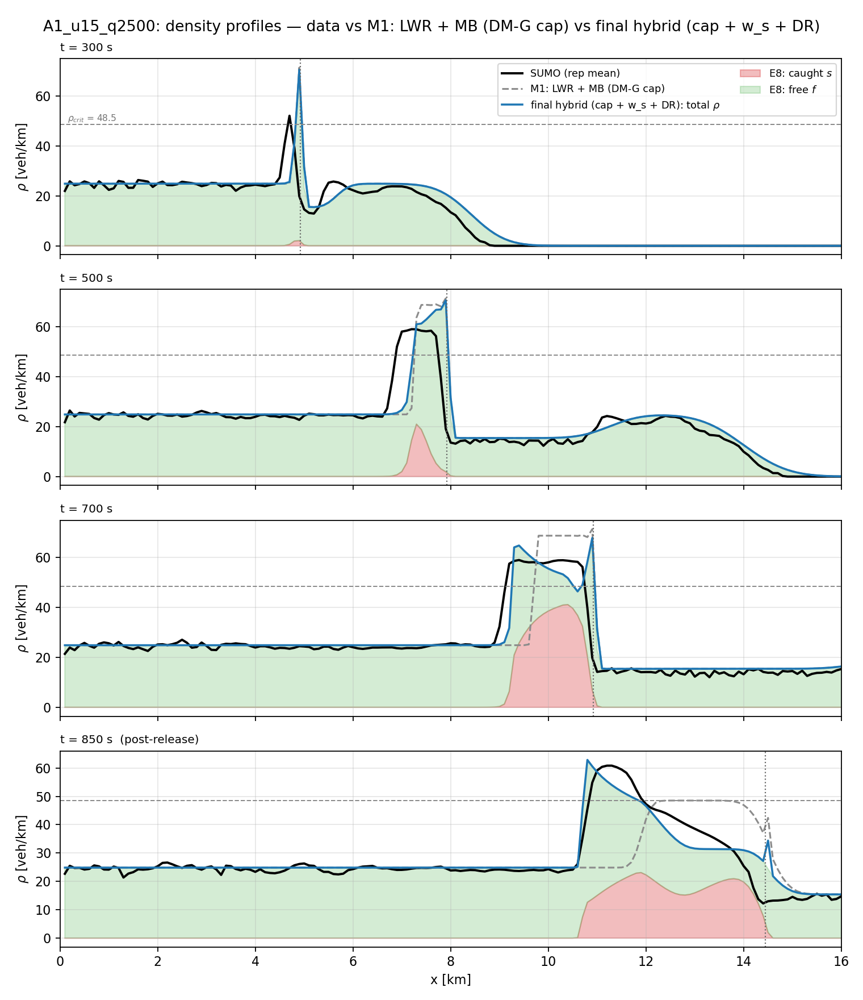
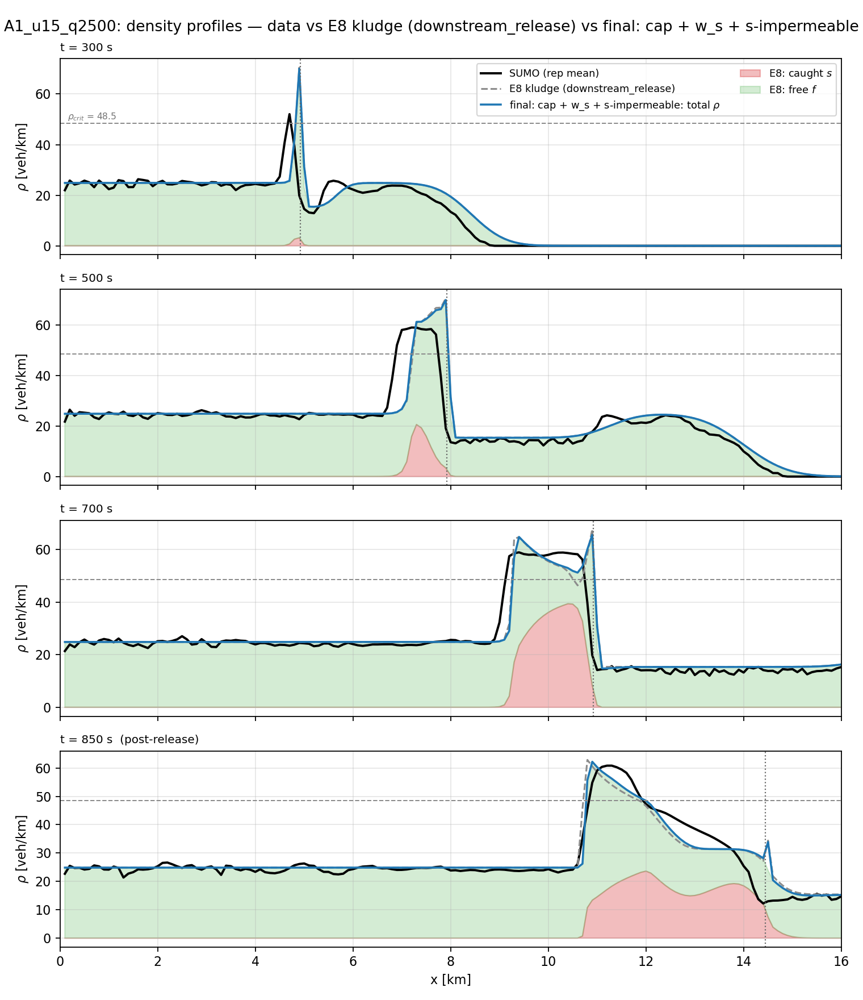
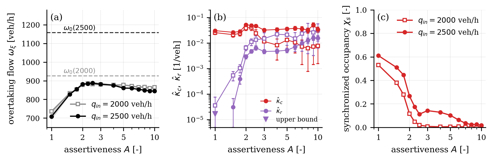
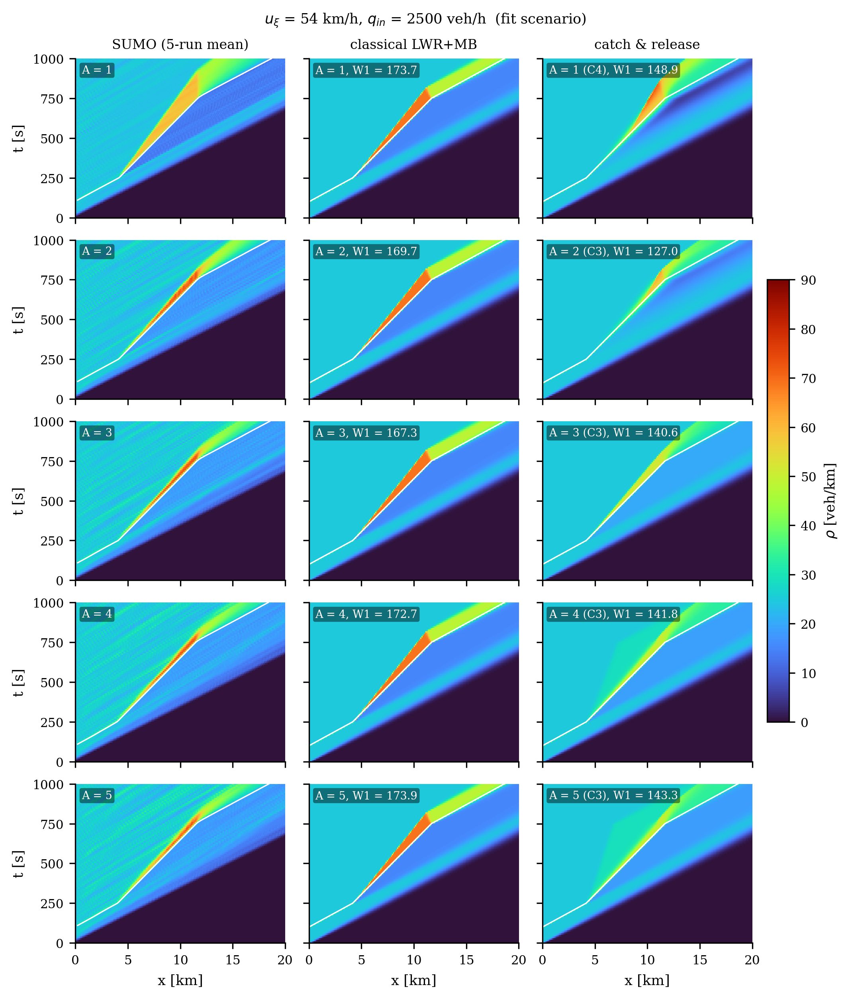

# Multi-class LWR Transition Model — SUMO Analysis Pipeline

This repository contains the full analysis pipeline for a **two-class LWR traffic
model with "catch & release"**, calibrated and validated against microscopic SUMO
experiments with a controlled slow vehicle (a *moving bottleneck*). The data come
from the experiments behind Krook, Čičić & Johansson, *"Learning Micro-Macro Models
for Traffic Control Using Microscopic Data"* (ECC 2022).

**The question:** a controlled vehicle slows down to 54 or 72 km/h on a two-lane
highway. Drivers behind it either stay stuck (low lane-changing assertiveness,
SUMO parameter A=1) or force their way past (high assertiveness, A=10). Can a
macroscopic model reproduce **both** behaviors just by changing the two
"catch & release" coefficients?

**The answer:** yes for the queue dynamics, and — after adding a bottleneck
capacity constraint — the 54 km/h scenarios match SUMO's cumulative flow to
within 7.5%. Better still, Step 8 shows the capacity constraint is not even
needed: with field-calibrated coefficients, catch & release **on its own** beats
the classical LWR + moving-bottleneck model on the density field in every
54 km/h scenario.

*Project focus (following Mladen's review): main results use the 54 km/h
(u=15) scenarios — moving-bottleneck models are known to be weak at extreme
speed differences; the stop-and-go analysis (Step 7) is kept for reference but
on ice, since this data set contains no significant stop-and-go waves.*

---

## The model in one paragraph

Traffic density is split into three parts: `a` (the slow controlled vehicle),
`f` (cars driving freely), and `s` (cars stuck behind the slow vehicle,
"synchronized"). All parts move according to a standard LWR/CTM model with one
shared triangular fundamental diagram. Two source terms exchange cars between
`f` and `s`:

- **capture** (a free car catches up and gets stuck): `J_c = κ_c · (a+s) · f · Δv`
- **release** (a stuck car escapes by overtaking): `J_r = κ_r · (P−ρ) · s · Δv`

where `Δv` is the speed advantage of free cars and `P` the jam density.
The whole A=1 vs A=10 difference must be carried by the two numbers `κ_c, κ_r`.

## The data

126 MATLAB files (`data_{A}_{u}_{q}_{True|False}.mat`, not included here) from a
30 km two-lane SUMO highway. In each run, background traffic flows in at
`q` veh/h; the controlled vehicle enters at t=100 s, drives at `u` m/s from
t=250 s to t=750 s, then speeds up again. Each file holds 5 repetitions with:
density and flow fields (10 s × 100 m grid), every vehicle's trajectory
(position, speed, lane), the controlled vehicle's trajectory, local measurements
just up/downstream of it, and the overtaking-flow time series.

---

## What we did, step by step

**Step 1 — Calibrate the road (E-V2).** From the dense A=3 scenario sweep we
fitted one triangular fundamental diagram — free-flow speed **v_f = 100.6 km/h**,
congestion wave speed **w = 22.4 km/h**, jam density **P = 266.7 veh/km** — and
froze it for everything that follows. Sanity check: the measured queue-tail shock
speed matches the Rankine–Hugoniot prediction to ~1 km/h.

**Step 2 — Verify the pure limits (E-V1).** Before the controlled vehicle
appears, traffic should follow `q = v_f·ρ`: it does (4.8% RMSE). Deep inside a
queue the aggregate should sit near the congested branch: it does, but the mean
speed is 13 km/h above the bottleneck speed — the left lane keeps overtaking.
That is the empirical reason the model needs the free/synchronized split at all.


**Step 3 — Classify every vehicle (E1).** Using the trajectories, each vehicle at
each time is labeled *caught* (behind the controlled vehicle, inside the queue
zone, speed ≈ bottleneck speed, with hysteresis) or *free*. Capture events =
free→caught; release events = caught→free, confirmed by an actual overtake.
Bookkeeping closes exactly: captures − releases = change in queue size, in every
run. Headline: at A=1, **398 captures and 0 releases** (5 reps pooled); at A=10
caught vehicles escape within ~20–50 s.

**Step 4 — Measure κ_c and κ_r (E-V3).** Each coefficient is estimated as a
Poisson rate: (number of events) / (integral of the model's covariate over the
exposure time). Result: **κ_r differs by 2–3 orders of magnitude between A=1 and
A=10** (< 1e-5 vs ≈ 4e-2 per vehicle), while κ_c stays the same order. This is
the core "parametrising catch & release works" result.

**Step 5 — Simulate and compare (E-V4).** We implemented the model's
finite-volume scheme (class-specific CTM fluxes + exact reaction update, all
conservation/positivity properties unit-tested) and ran the eight core scenarios
forward with zero refitting. The queue/no-queue regimes come out right, but the
model lets too much traffic past the bottleneck (cumulative-flow error e_s
+10…+36%) — because nothing in it limits the flow at the bottleneck itself.

**Step 6 — Add the capacity constraint (E-V4b).** We added the
Delle Monache–Goatin moving flux constraint (flux past the bottleneck ≤ ω_max,
implemented as a Godunov-type cap at the interface; the naive "cap by local cell
density" version is provably bistable and does not work). With the ECC22
bottleneck capacity (≈2000 veh/h), **all four 54 km/h scenarios reach
|e_s| ≤ 7.5%** — both A=1 and A=10, still zero refitting. The same capacity fails
at 72 km/h: measured overtaking flows imply the effective bottleneck capacity
itself depends on A. Second finding: with the physically correct queue in place,
the product-form capture term underpredicts queue growth — SUMO captures one car
per arrival (linear growth), pointing to an **arrival-flux capture law**.


**Step 7 — Stop-and-go analysis (E-V5).** Two independent tools:
(a) the **dispersion relation** of the calibrated model, derived symbolically and
verified with sympy: for A=1 the model is unstable but with *k-independent*
growth (it grows one queue, it cannot select a wavelength); for A=10 it is
stable. So the model cannot produce spontaneous stop-and-go waves — proven, not
suspected. (b) **2D FFT wave spectra** of the SUMO density fields: the visible
stripes actually travel *forward* (+50…+100 km/h, advected with traffic), their
amplitude doubles from A=1 to A=10, and backward-moving energy peaks at mid
assertiveness (A=3) but never dominates. In the same analysis box the simulated
field has zero fluctuation energy vs 2–4 veh/km in SUMO — a clean, quantified
statement of what a relaxation-time extension of the source would need to add.


**Step 8 — Catch & release as a native moving-bottleneck model (E6).**
Following Mladen's suggestion, we dropped the capacity constraint and instead
fitted (kappa_c, kappa_r) directly to the measured density field (fit at
q=2500 veh/h, then transferred unchanged to q=2000). The native model beats
the classical LWR+MB baseline on density-field RMSE in **all four** 54 km/h
scenarios and keeps |e_s| <= 4.8%. The reason it can: inside its queue a stuck
stream (s) and a free stream (f) coexist, so the aggregate state lies *inside*
the flux function — the low-assertiveness two-stream regime that scalar LWR
cannot express. Costs (reported honestly): overtaking flow is underpredicted,
and at A=10 the fitted s is a modeling device rather than the literal caught
population. See `E6_results.md`.



**Step 9 — Wasserstein calibration, stuck-class flux function, speed transfer (E7).**
Following the second review round we (i) switched the calibration objective to
the 1-Wasserstein distance between cumulative density curves, (ii) added two
structural knobs (capture-localization gamma and a stuck-class congested branch
w_s <= w), and (iii) ran a speed-transfer study. Outcome: for A=1 the
W1 + stuck-class-flux fit makes the wake supercritical (55.5 vs data's
58.6 veh/km) and **restores the post-release rarefaction** that the E6 fit
lacked — one bug (subcritical wedge under a triangular FD) had caused both
symptoms; the overtaking-flow error also collapses (-32% -> -9%). For A=10 the
model produces the "slow but not stuck" band (an inside-the-flux-function
state), though with fast capture/release churn instead of the measured 20-50 s
turnover — a partial structural limit, honestly reported. Transfer: kappas
fitted at u=15 only predict u = 10...24 with a flat W1 curve (<= 5.9% growth),
at or below the classical LWR+MB baseline almost everywhere. See `E7_results.md`.





**Step 10 — The downstream-release constraint and the final hybrid (E8).**
Third review round. We added the zero-parameter *downstream-release* constraint
(a vehicle cannot be caught by a bottleneck behind it: s strictly downstream of
the CAV converts to f) and ran the one-at-a-time ladder Mladen asked for. Two
findings: (i) the previous fit's leaked downstream stuck vehicles had been
acting as a *plug* that throttled the bottleneck — removing them uncorks the
flow (omega error jumps to +42%), proving that catch & release alone cannot both
keep the downstream clean and throttle the bottleneck: the capacity term is
structurally necessary. (ii) The free-flow "waviness" has a closed form — the
source growth rate is exactly Delta-v (kappa_c rho - kappa_r (P - rho)),
k-independent; under the constraint the downstream source vanishes identically,
so waviness in free flow is impossible while congestion waves remain allowed.
Final model = capacity cap + catch & release + downstream release
(+ the stuck-class branch w_s): A=1 gets a supercritical wake on the data
plateau, a matching rarefaction fan, clean downstream, omega error -2.5%;
A=10 gets e_s = +0.2% with kappa_r landing on the event-measured value.
See `E8_results.md`.



**Step 11 — Replacing the kludge by general model structure (E9/E10).**
The fourth review rejected the downstream-release rule as a kludge (it converts
labels based on the CAV's position — scenario information, not traffic state).
Two general replacements were tried, one at a time. A state-only *leader-loss*
release (a stuck vehicle with no slow vehicle ahead within a look-ahead distance
is released; front receding at the start-up wave speed w) failed: it released
inside the queue, and the downstream stuck vehicles it was meant to remove turned
out to be numerical front diffusion across the CAV cell. What works is an
**interface constraint of the same kind as the Delle Monache–Goatin cap**: *only
free vehicles overtake the bottleneck* — the synchronized class has zero flux
relative to the moving bottleneck. It has no parameters, references no label
conversion, and reproduces the kludge's results on the calibration scenario
(W1 152.0 vs 152.2; wake 55.1 vs 53.8 veh/km; e_s +3.9% vs +4.7%; ω −2.5% both;
downstream exactly clean while the bottleneck is active). Honest gaps: at A=10 and
in the q=2000 transfers the general model is 8–18% worse in W1 than the kludge.
See `E10_results.md`.



**Step 12 — Best instantiation and the paper figure set (E11, `out/paper/`).**
With the general structure fixed, we instantiated it per assertiveness by
fitting four parameters (κ_c, κ_r, the capture-localization weight γ, and the
stuck-class wave speed w_s) to the u=54 km/h, q=2500 veh/h field with the
1-Wasserstein objective, and validated on the other three scenarios per A with
zero refitting. A capacity-cap ablation showed the Delle Monache–Goatin cap is
**not needed** once the bottleneck interface is impermeable to stuck vehicles
(fit-scenario W1 changes by < 0.1% without it), so the adopted final model has
no capacity constraint at all: catch & release + stuck-class branch +
impermeable interface. Headline: on the calibration scenarios W1 improves 20%
(A=1) and 13% (A=10) over classical LWR+MB with |e_s| ≤ 7.4%; at 72 km/h the
model beats the classical baseline in W1 in all four transfers but overshoots
the cumulative flow (+12…+19% at A=1) where the classical cap undershoots
(−24…−28%). The assertiveness sweep (all 14 A values, 140 runs) gives the
micro–macro link figure: κ_r rises ~3 orders of magnitude from A=1 to A=10
while κ_c stays flat, and the measured overtaking flow reproduces the A≈2–3
maximum of ECC22. Honest gaps: the A=10 model over-forms a band at q=2000
(W1 146 vs classical 122), and neither model reproduces SUMO's
speed-independent through-flow across bottleneck speeds (transfer figure).
Figures (300 dpi PNG + PDF, captions in `out/paper/captions.md`):
Fig 1 `fig_fd` (calibrated FD), Fig 2 `fig_assertiveness` (ω, κ, χ vs A),
Fig 3 `fig_heatmaps_q2500` (+ S1 `fig_heatmaps_q2000`), Fig 4 `fig_es`
(cumulative-flow error with 5-run min/max), Fig 5 `fig_profiles` (stuck/free
split), Fig 6 `fig_transfer` (speed transfer); Table 1 `table_metrics.md`.



### Step 13 — Back to the pure E7 model on the integer ladder A = 1…10 (E12)

Mladen's fifth review asked to roll back to E7 and iterate from there with
**no kludge and no imposed physical constraint** (the downstream flow is still
affected after the CAV speeds up, so stuck vehicles must not be forced free),
to restrict assertiveness to the ten integers 1…10, to look at every A's
heatmap, and to test the hypothesis "low A → high κ_c, high A → low κ_c".
`e12_assertiveness.py` runs exactly the E7 structure (uncapped catch &
release, optional γ and w_s; the four post-E7 knobs are forbidden by a guard
and pinned by tests), fits the four E7 configurations per A on 54 km/h /
2500 veh/h, transfers to 2000 veh/h and 72 km/h with zero refitting, and
compares nested shared-parameter models over all ten A (one κ pair for all A;
κ_c(A) free; κ_r(A) free; both free). Headline: **the pure E7 model beats
classical LWR+MB in W1 at every A and in all 40 scenario cells** (14–27 %
for A ≥ 3; the "A = 10 worse than classical" verdict came from the E10/E11
interface + cap configuration). But at A ≥ 4 it wins by the wrong mechanism:
a 3 km dilute stuck band (33 veh/km, SUMO 55) with 25–50 phantom stuck
vehicles and a 40 % overtaking deficit. The hypothesis is **undecidable from
density fields**: κ_c(A)-free and κ_r(A)-free models are 0.02 % apart because
for A ≥ 2 the fit sits on a fast-equilibrium ridge where only the ratio
κ_c/κ_r ≈ 10 is identified (flat in the magnitude above κ_r ≈ 0.1); only
A = 1 needs slow kinetics. The microscopic event calibration, which does
separate the two, says A acts through κ_r (Spearman +0.99), not κ_c — but
those rates do not reproduce the fields (W1 197–262 for A ≥ 3). Proposed
next step: calibrate on W1 + queue size + overtaking flow to break the
degeneracy. Report: `E12_results.md`; figures in `out/e12/` (heatmap grids
for every A at both inflows, κ vs A, nested-model comparison, ridge scan,
profiles).



---

## How to run

Requires Python 3.12 with numpy/scipy/matplotlib, and the (not included) SUMO
`.mat` files in `../Second/`. Run in this order:

```bash
python3 ev2_calibrate.py         # fit (v_f, w, P)            -> out/params.json
python3 ev1_pure_class.py        # pure-limit checks + A-contrast heatmaps
python3 e1_classify.py           # per-vehicle caught/free + events -> out/e1/
python3 ev3_calibrate_kappa.py   # kappa_c, kappa_r MLE       -> out/ev3_kappa.json
python3 test_solver.py           # 9 solver unit tests
python3 ev4_compare.py --form lf             # E-V4 baseline  -> out/ev4/
python3 ev4_compare.py --form lf --qxi 2000  # E-V4b capacity cap -> out/ev4b_q2000/
python3 ev5_dispersion.py        # linear stability            -> out/ev5/
python3 ev5_waves.py             # wave spectra of the data (--selftest available)
python3 ev5_sim_vs_data.py       # model-vs-data spectra, same analysis box
python3 e6_native_mb.py          # E6: native-MB fit + 3-model comparison -> out/e6/
python3 e7_wasserstein.py --selftest  # E7: W1 metric gate
python3 e7_ablation.py           # E7: W1/gamma/w_s ablation -> out/e7/
python3 e7_transfer.py           # E7: speed-transfer sweep -> out/e7/
python3 e8_ladder.py --run       # E8: one-at-a-time ladder -> out/e8/
python3 e8_final.py              # E8: final hybrid figures + config
python3 e9_ladder.py --run       # E9: ratio-form leader-loss ladder (negative result)
python3 e10_ladder.py --run      # E10: interface-constraint / leader-loss attribution ladder
python3 e10_final.py             # E10: final general model vs the kludge
python3 e11_tune.py --run        # E11: 4/5-parameter instantiation per A (--ablate: cap ablation, --figures)
python3 e4_sweep.py              # E11: assertiveness sweep (14 A values) -> fig_assertiveness
python3 e11_transfer_fd.py       # E11: speed transfer + FD figure (paper style)
python3 e12_assertiveness.py --run --figures --summary   # E12: pure E7 model, A = 1..10 (--smoke for a 10 s check)
python3 -m pytest -q test_e12.py && python3 audit_e12.py  # E12 tests + independent audit
```

## File guide

### Core modules

| File | What it does |
|---|---|
| `loader.py` | Reads the SUMO `.mat` files: parses scenario parameters from filenames, loads density/flow fields, up/downstream measurements, overtaking flow, and all trajectories into typed `Scenario`/`Rep` objects. |
| `fd.py` | Triangular fundamental diagram (flux/demand/supply/speed), robust fitting of the free-flow and congested branches, and the ECC22 steady-state averaging rule. |
| `solver.py` | The model's numerical scheme: class-specific CTM transport + exact reaction substep, the controlled vehicle as a prescribed moving point mass, and the optional Delle Monache–Goatin capacity cap (`q_xi_max`). Conservation, positivity and CFL are enforced and tested. |

### Analysis scripts (one per experiment)

| File | What it does |
|---|---|
| `ev2_calibrate.py` | **E-V2**: fits (v_f, w, P) from the A=3 sweep; Rankine–Hugoniot consistency check of the queue-tail shock. |
| `ev1_pure_class.py` | **E-V1**: verifies the free-flow and congested pure limits; produces the A=1 vs A=10 density heatmaps. |
| `e1_classify.py` | **E1**: hysteresis caught/free classification of every vehicle, capture/release event extraction, classified per-cell density fields. |
| `ev3_calibrate_kappa.py` | **E-V3**: Poisson-exposure maximum-likelihood estimates of κ_c and κ_r per scenario, with confidence intervals and rate-fit diagnostics. |
| `ev4_compare.py` | **E-V4/E-V4b**: runs the solver for all 8 scenarios, regrids to the data grid, and scores density RMSE, queue-size error, overtaking-flow error, and the ECC22 cumulative-flow error e_s; `--qxi` enables the capacity cap. |
| `ev5_dispersion.py` | **E-V5 (model)**: dispersion relation Λ(k) of the calibrated model on both equilibrium branches in both smooth regimes; stability maps. |
| `ev5_waves.py` | **E-V5 (data)**: 2D FFT wave spectra of the density fields (amplitude, propagation direction, dominant speed); includes a synthetic-wave self-test that gates the sign conventions. |
| `ev5_sim_vs_data.py` | **E-V5 (closure)**: same-box spectral comparison of the simulated vs measured fields. |
| `e6_native_mb.py` | **E6**: fits (κ_c, κ_r) to the measured density field and compares three models — classical LWR+MB (DM-G cap, κ=0), native catch & release (no cap), and the capped E-V4b variant — on heatmaps, profile snapshots with the f/s split, and all four metrics. |
| `e7_wasserstein.py` | **E7**: 1-Wasserstein calibration infrastructure (cumulative-density metric with a synthetic exactness gate) and the generic field-fit machinery. |
| `e7_ablation.py` | **E7**: RMSE-vs-W1 and structural-knob ablation (gamma, w_s), wake-density / rarefaction / dynamic-equilibrium diagnostics, winner figures. |
| `e7_transfer.py` | **E7**: speed-transfer study — kappas fitted at u=15 predicting u=10…24, vs the classical baseline. |
| `e8_ladder.py` | **E8**: one-at-a-time ablation ladder (metric / w_s / downstream-release), waviness and wake diagnostics, analytic growth checks. |
| `e8_final.py` | **E8**: final hybrid configuration (cap + w_s + downstream release) — figures and summary. |
| `e9_ladder.py` | **E9**: ratio-form leader-loss ladder (the negative result: in-queue release, numerical plume). |
| `e10_ladder.py` | **E10**: one-at-a-time attribution — s-impermeable interface vs connectivity leader-loss vs w_s. |
| `e10_final.py` | **E10**: the final general model (cap + w_s + s-impermeable interface) vs the E8 kludge, with figures. |
| `paperfig.py` | Shared publication figure style (serif, column widths, colour conventions; PNG + PDF export to `out/paper/`). |
| `e11_tune.py` | **E11**: per-assertiveness instantiation (Nelder–Mead on W1), capacity-cap ablation, metrics table, Figs 3–5. |
| `e12_assertiveness.py` | **E12**: pure E7 model on A = 1…10 — purity guard, per-A C1–C4 fits and transfers (stage a), nested shared-parameter hypothesis test (stage b), event-κ field check + ridge scan (stage e). |
| `e12_figures.py` | E12 figures (heatmap grids for every A, κ vs A, nested-model bars, ridge scan, profiles) and `summary.md`. |
| `e4_sweep.py` | **E11**: assertiveness sweep — classification + Poisson MLE for all 14 A values, Fig 2. |
| `e11_transfer_fd.py` | **E11**: speed-transfer sweep (A=3 anchor, zero refit) and the FD figure, Figs 1 and 6. |

### Tests and independent audits

| File | What it does |
|---|---|
| `test_solver.py` | 24 unit tests: mass ledger, invariant domain, pure-class front speed, Riemann shock vs RH, queue smoke tests, CFL guard, cap-off bit-identity, capped steady state vs the analytic solution. |
| `audit_solver.py` | Independent numerical audit of the solver (written by a separate review pass): re-derives the mass balance step by step, dt-refinement, reaction exactness vs closed form. |
| `audit_cap.py` | Independent audit of the capacity cap: inertness when disabled, conservation with the cap active, analytic steady state re-derived by bisection, sign guards. |
| `audit_dispersion.py` | Independent sympy re-derivation of all Jacobians and the dispersion relation; compares against the module to machine precision (exit 0 = pass). |
| `audit_e7.py` | Independent audit of the gamma/w_s/P_s solver knobs (bit-identity, invariants, cap-path regression). |
| `audit_e8.py` | Independent audit of the downstream-release constraint (bit-identity vs git, boundary semantics, invariants). |
| `audit_e9.py`, `audit_e10.py` | Independent audits of the leader-loss terms and the impermeable interface (bit-identity vs git HEAD, invariants, exactness, generality checks). |
| `test_e12.py` | 17 tests: solver defaults are the pure path, purity guard rejects every forbidden knob, A set is exactly 1…10, data routing (out/e1 vs out/e4), bit-identity of the E12 solver bridge with E7. |
| `audit_e12.py` | Independent audit of E12: purity of every stored configuration, bit-level reproduction of W1 values, grid entries, winner rule, hypothesis totals + nestedness, Spearman values, event metrics, summary vs JSON. |

### Reports (read these for the full story)

| File | Covers |
|---|---|
| `E_V1_V2_results.md` | Calibration values, pure-limit verification, and what the two-lane aggregation does to the measurements. |
| `E1_EV3_results.md` | The κ table with confidence intervals, the A=1 vs A=10 contrast, and the identifiability discussion. |
| `E_V4_results.md` | Baseline forward validation: what matches, what fails, and the case for the capacity constraint. |
| `E_V4b_V5_results.md` | Capacity-cap results, the A-dependence of the bottleneck capacity, the dispersion theorem, the wave spectra, and the model-vs-data closure. |
| `E6_results.md` | The native moving-bottleneck result: field-calibrated catch & release vs classical LWR+MB, the two-stream interpretation, and the honest trade-offs. |
| `E7_results.md` | Wasserstein calibration, the stuck-class flux function fix (supercritical wake + restored rarefaction), the A=10 dynamic-equilibrium verdict, and the speed-transfer study. |
| `E8_results.md` | The downstream-release constraint, the plug discovery (why the capacity term is structurally necessary), the closed-form no-waviness condition, and the final hybrid configuration. |
| `E10_results.md` | Why the kludge had to go, the failed general attempt (E9), the one-at-a-time ladder, the interface constraint that replaces it, and the final general model with honest gaps. |
| `E12_plan.md`, `E12_results.md` | The rollback to the pure E7 model: every A vs classical, the A ≥ 4 mechanism problem, why the κ_c-vs-κ_r hypothesis is undecidable from density fields (fast-equilibrium ridge), what the event calibration says, and the proposed joint-objective calibration. |

### Outputs (`out/`)

| Path | Contents |
|---|---|
| `params.json` | Calibrated (v_f, w, P) with fit diagnostics. |
| `ev3_kappa.json` | Full κ_c/κ_r table (point estimates + 95% CIs + exposures) for all 8 scenarios. |
| `e1/` | Per-run classification results (`.npz`): caught counts, events, classified fields. |
| `ev4/`, `ev4_af/` | Baseline comparison metrics and figures (two capture-law variants). |
| `ev4b_q2000/`, `ev4b_q2440/` (+`_af`) | Capacity-capped comparison metrics and figures. |
| `ev5/` | Dispersion summary + stability maps, wave-spectra summary + figures, model-vs-data spectra. |
| `e6/` | Native-MB fit results, three-model metrics, heatmap and profile comparison figures. |
| `e7/` | Ablation table, transfer curve + JSON, winner profile/heatmap figures (incl. the t=850 post-release panel). |
| `e8/` | Ladder JSON, hybrid/candidate evaluations, final-configuration figures. |
| `e9/`, `e10/` | Leader-loss ladder (E9), attribution ladder + final general-model configuration and figures (E10). |
| `e4/`, `paper/` | Assertiveness-sweep classification + κ(A) table (E4); the paper figure set, metrics table, captions, tuned configuration (E11). |
| `e12/` | Pure-E7 ladder: `ladder.json` (per-A fits, evaluations, classical, grid landscape), `hypothesis.json` (nested models, trends), `extras.json` (event κ in the field, ridge scan), `fields_A*.npz`, `summary.md`, figures `fig_e12_*`. |
| `ev4b_staging/` | Archive of the build artifacts (patches, reference outputs, capped-run mirror). |

## Data conventions and gotchas

- Units: densities veh/km (two-lane aggregate), flows veh/h, speeds km/h in the
  data layer; SI internally in the solver. κ values are per-vehicle and
  unit-invariant between the two.
- Only the `_True.mat` files are used (1000 s runs; the `_False` variant stops at
  700 s and covers fewer A values).
- The up/downstream measurements are **two-lane mixtures**: for moderate
  bottleneck speeds they fall *inside* the concave fundamental diagram (right
  lane queued + left lane overtaking). Only strongly congested states sample the
  congested branch itself — this is why the FD is fitted the way it is.
- The queue-discharge wave (−w) is **not directly observable** for a moving
  bottleneck: after release the density boundary moves with the platoon, not
  with the kinematic wave. The queue-tail shock during growth is the clean check.
- κ must be calibrated inside the slow window [260, 740] s only: after t=750 s
  the speed advantage Δv is zero by construction and queue dissolution is a
  transport process, not "release".
- In `trajectory_vehicle_S_{n}_...` variable names the first number is a
  constant 3, not the assertiveness value; parse scenario parameters from the
  *filename*, and per-trajectory (start-time, repetition) from the last two
  numbers.
