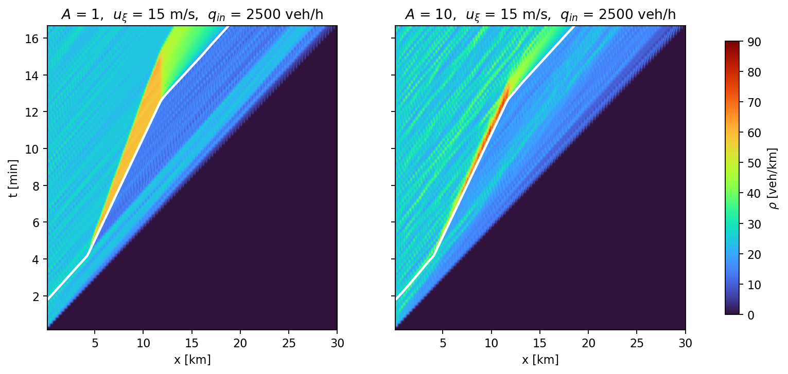
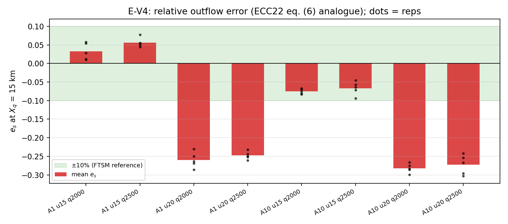
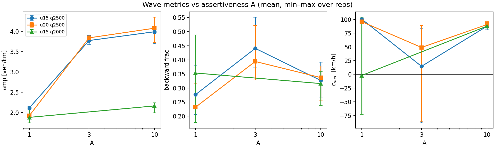

# Multi-class LWR Transition Model — SUMO Analysis Pipeline

This repository contains the full analysis pipeline for a **two-class LWR traffic
model with "catch & release"**, calibrated and validated against microscopic SUMO
experiments with a controlled slow vehicle (a *moving bottleneck*). The data come
from the experiments behind Krook, Čičić & Johansson, *"Learning Micro-Macro Models
for Traffic Control Using Microscopic Data"* (ECC 2022).

**The question:** a controlled vehicle slows down to 54 or 72 km/h on a two-lane
highway. Drivers behind it either stay stuck (low lane-changing assertiveness,
SUMO parameter A=1) or force their way past (high assertiveness, A=10). Can a
macroscopic model reproduce **both** behaviors just by changing the two
"catch & release" coefficients?

**The answer:** yes for the queue dynamics, and — after adding a bottleneck
capacity constraint — the 54 km/h scenarios match SUMO's cumulative flow to
within 7.5%. Along the way we learned exactly which two parts of the model need
to change next (details below).

---

## The model in one paragraph

Traffic density is split into three parts: `a` (the slow controlled vehicle),
`f` (cars driving freely), and `s` (cars stuck behind the slow vehicle,
"synchronized"). All parts move according to a standard LWR/CTM model with one
shared triangular fundamental diagram. Two source terms exchange cars between
`f` and `s`:

- **capture** (a free car catches up and gets stuck): `J_c = κ_c · (a+s) · f · Δv`
- **release** (a stuck car escapes by overtaking): `J_r = κ_r · (P−ρ) · s · Δv`

where `Δv` is the speed advantage of free cars and `P` the jam density.
The whole A=1 vs A=10 difference must be carried by the two numbers `κ_c, κ_r`.

## The data

126 MATLAB files (`data_{A}_{u}_{q}_{True|False}.mat`, not included here) from a
30 km two-lane SUMO highway. In each run, background traffic flows in at
`q` veh/h; the controlled vehicle enters at t=100 s, drives at `u` m/s from
t=250 s to t=750 s, then speeds up again. Each file holds 5 repetitions with:
density and flow fields (10 s × 100 m grid), every vehicle's trajectory
(position, speed, lane), the controlled vehicle's trajectory, local measurements
just up/downstream of it, and the overtaking-flow time series.

---

## What we did, step by step

**Step 1 — Calibrate the road (E-V2).** From the dense A=3 scenario sweep we
fitted one triangular fundamental diagram — free-flow speed **v_f = 100.6 km/h**,
congestion wave speed **w = 22.4 km/h**, jam density **P = 266.7 veh/km** — and
froze it for everything that follows. Sanity check: the measured queue-tail shock
speed matches the Rankine–Hugoniot prediction to ~1 km/h.

**Step 2 — Verify the pure limits (E-V1).** Before the controlled vehicle
appears, traffic should follow `q = v_f·ρ`: it does (4.8% RMSE). Deep inside a
queue the aggregate should sit near the congested branch: it does, but the mean
speed is 13 km/h above the bottleneck speed — the left lane keeps overtaking.
That is the empirical reason the model needs the free/synchronized split at all.



**Step 3 — Classify every vehicle (E1).** Using the trajectories, each vehicle at
each time is labeled *caught* (behind the controlled vehicle, inside the queue
zone, speed ≈ bottleneck speed, with hysteresis) or *free*. Capture events =
free→caught; release events = caught→free, confirmed by an actual overtake.
Bookkeeping closes exactly: captures − releases = change in queue size, in every
run. Headline: at A=1, **398 captures and 0 releases** (5 reps pooled); at A=10
caught vehicles escape within ~20–50 s.

**Step 4 — Measure κ_c and κ_r (E-V3).** Each coefficient is estimated as a
Poisson rate: (number of events) / (integral of the model's covariate over the
exposure time). Result: **κ_r differs by 2–3 orders of magnitude between A=1 and
A=10** (< 1e-5 vs ≈ 4e-2 per vehicle), while κ_c stays the same order. This is
the core "parametrising catch & release works" result.

**Step 5 — Simulate and compare (E-V4).** We implemented the model's
finite-volume scheme (class-specific CTM fluxes + exact reaction update, all
conservation/positivity properties unit-tested) and ran the eight core scenarios
forward with zero refitting. The queue/no-queue regimes come out right, but the
model lets too much traffic past the bottleneck (cumulative-flow error e_s
+10…+36%) — because nothing in it limits the flow at the bottleneck itself.

**Step 6 — Add the capacity constraint (E-V4b).** We added the
Delle Monache–Goatin moving flux constraint (flux past the bottleneck ≤ ω_max,
implemented as a Godunov-type cap at the interface; the naive "cap by local cell
density" version is provably bistable and does not work). With the ECC22
bottleneck capacity (≈2000 veh/h), **all four 54 km/h scenarios reach
|e_s| ≤ 7.5%** — both A=1 and A=10, still zero refitting. The same capacity fails
at 72 km/h: measured overtaking flows imply the effective bottleneck capacity
itself depends on A. Second finding: with the physically correct queue in place,
the product-form capture term underpredicts queue growth — SUMO captures one car
per arrival (linear growth), pointing to an **arrival-flux capture law**.



**Step 7 — Stop-and-go analysis (E-V5).** Two independent tools:
(a) the **dispersion relation** of the calibrated model, derived symbolically and
verified with sympy: for A=1 the model is unstable but with *k-independent*
growth (it grows one queue, it cannot select a wavelength); for A=10 it is
stable. So the model cannot produce spontaneous stop-and-go waves — proven, not
suspected. (b) **2D FFT wave spectra** of the SUMO density fields: the visible
stripes actually travel *forward* (+50…+100 km/h, advected with traffic), their
amplitude doubles from A=1 to A=10, and backward-moving energy peaks at mid
assertiveness (A=3) but never dominates. In the same analysis box the simulated
field has zero fluctuation energy vs 2–4 veh/km in SUMO — a clean, quantified
statement of what a relaxation-time extension of the source would need to add.



---

## How to run

Requires Python 3.12 with numpy/scipy/matplotlib, and the (not included) SUMO
`.mat` files in `../Second/`. Run in this order:

```bash
python3 ev2_calibrate.py         # fit (v_f, w, P)            -> out/params.json
python3 ev1_pure_class.py        # pure-limit checks + A-contrast heatmaps
python3 e1_classify.py           # per-vehicle caught/free + events -> out/e1/
python3 ev3_calibrate_kappa.py   # kappa_c, kappa_r MLE       -> out/ev3_kappa.json
python3 test_solver.py           # 9 solver unit tests
python3 ev4_compare.py --form lf             # E-V4 baseline  -> out/ev4/
python3 ev4_compare.py --form lf --qxi 2000  # E-V4b capacity cap -> out/ev4b_q2000/
python3 ev5_dispersion.py        # linear stability            -> out/ev5/
python3 ev5_waves.py             # wave spectra of the data (--selftest available)
python3 ev5_sim_vs_data.py       # model-vs-data spectra, same analysis box
```

## File guide

### Core modules

| File | What it does |
|---|---|
| `loader.py` | Reads the SUMO `.mat` files: parses scenario parameters from filenames, loads density/flow fields, up/downstream measurements, overtaking flow, and all trajectories into typed `Scenario`/`Rep` objects. |
| `fd.py` | Triangular fundamental diagram (flux/demand/supply/speed), robust fitting of the free-flow and congested branches, and the ECC22 steady-state averaging rule. |
| `solver.py` | The model's numerical scheme: class-specific CTM transport + exact reaction substep, the controlled vehicle as a prescribed moving point mass, and the optional Delle Monache–Goatin capacity cap (`q_xi_max`). Conservation, positivity and CFL are enforced and tested. |

### Analysis scripts (one per experiment)

| File | What it does |
|---|---|
| `ev2_calibrate.py` | **E-V2**: fits (v_f, w, P) from the A=3 sweep; Rankine–Hugoniot consistency check of the queue-tail shock. |
| `ev1_pure_class.py` | **E-V1**: verifies the free-flow and congested pure limits; produces the A=1 vs A=10 density heatmaps. |
| `e1_classify.py` | **E1**: hysteresis caught/free classification of every vehicle, capture/release event extraction, classified per-cell density fields. |
| `ev3_calibrate_kappa.py` | **E-V3**: Poisson-exposure maximum-likelihood estimates of κ_c and κ_r per scenario, with confidence intervals and rate-fit diagnostics. |
| `ev4_compare.py` | **E-V4/E-V4b**: runs the solver for all 8 scenarios, regrids to the data grid, and scores density RMSE, queue-size error, overtaking-flow error, and the ECC22 cumulative-flow error e_s; `--qxi` enables the capacity cap. |
| `ev5_dispersion.py` | **E-V5 (model)**: dispersion relation Λ(k) of the calibrated model on both equilibrium branches in both smooth regimes; stability maps. |
| `ev5_waves.py` | **E-V5 (data)**: 2D FFT wave spectra of the density fields (amplitude, propagation direction, dominant speed); includes a synthetic-wave self-test that gates the sign conventions. |
| `ev5_sim_vs_data.py` | **E-V5 (closure)**: same-box spectral comparison of the simulated vs measured fields. |

### Tests and independent audits

| File | What it does |
|---|---|
| `test_solver.py` | 9 unit tests: mass ledger, invariant domain, pure-class front speed, Riemann shock vs RH, queue smoke tests, CFL guard, cap-off bit-identity, capped steady state vs the analytic solution. |
| `audit_solver.py` | Independent numerical audit of the solver (written by a separate review pass): re-derives the mass balance step by step, dt-refinement, reaction exactness vs closed form. |
| `audit_cap.py` | Independent audit of the capacity cap: inertness when disabled, conservation with the cap active, analytic steady state re-derived by bisection, sign guards. |
| `audit_dispersion.py` | Independent sympy re-derivation of all Jacobians and the dispersion relation; compares against the module to machine precision (exit 0 = pass). |

### Reports (read these for the full story)

| File | Covers |
|---|---|
| `E_V1_V2_results.md` | Calibration values, pure-limit verification, and what the two-lane aggregation does to the measurements. |
| `E1_EV3_results.md` | The κ table with confidence intervals, the A=1 vs A=10 contrast, and the identifiability discussion. |
| `E_V4_results.md` | Baseline forward validation: what matches, what fails, and the case for the capacity constraint. |
| `E_V4b_V5_results.md` | Capacity-cap results, the A-dependence of the bottleneck capacity, the dispersion theorem, the wave spectra, and the model-vs-data closure. |

### Outputs (`out/`)

| Path | Contents |
|---|---|
| `params.json` | Calibrated (v_f, w, P) with fit diagnostics. |
| `ev3_kappa.json` | Full κ_c/κ_r table (point estimates + 95% CIs + exposures) for all 8 scenarios. |
| `e1/` | Per-run classification results (`.npz`): caught counts, events, classified fields. |
| `ev4/`, `ev4_af/` | Baseline comparison metrics and figures (two capture-law variants). |
| `ev4b_q2000/`, `ev4b_q2440/` (+`_af`) | Capacity-capped comparison metrics and figures. |
| `ev5/` | Dispersion summary + stability maps, wave-spectra summary + figures, model-vs-data spectra. |
| `ev4b_staging/` | Archive of the build artifacts (patches, reference outputs, capped-run mirror). |

## Data conventions and gotchas

- Units: densities veh/km (two-lane aggregate), flows veh/h, speeds km/h in the
  data layer; SI internally in the solver. κ values are per-vehicle and
  unit-invariant between the two.
- Only the `_True.mat` files are used (1000 s runs; the `_False` variant stops at
  700 s and covers fewer A values).
- The up/downstream measurements are **two-lane mixtures**: for moderate
  bottleneck speeds they fall *inside* the concave fundamental diagram (right
  lane queued + left lane overtaking). Only strongly congested states sample the
  congested branch itself — this is why the FD is fitted the way it is.
- The queue-discharge wave (−w) is **not directly observable** for a moving
  bottleneck: after release the density boundary moves with the platoon, not
  with the kinematic wave. The queue-tail shock during growth is the clean check.
- κ must be calibrated inside the slow window [260, 740] s only: after t=750 s
  the speed advantage Δv is zero by construction and queue dissolution is a
  transport process, not "release".
- In `trajectory_vehicle_S_{n}_...` variable names the first number is a
  constant 3, not the assertiveness value; parse scenario parameters from the
  *filename*, and per-trajectory (start-time, repetition) from the last two
  numbers.
